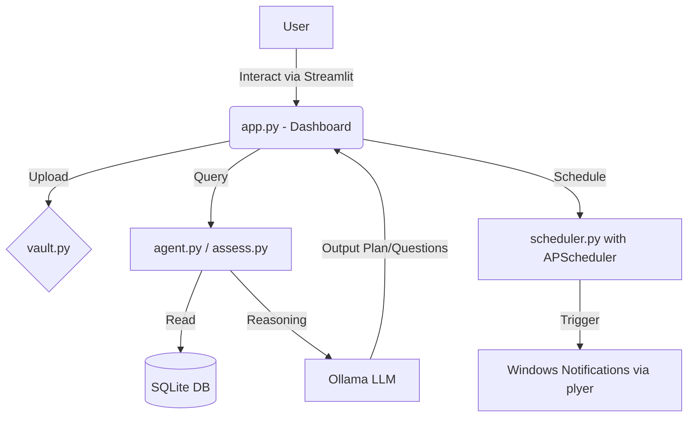

# System Design Document
# Placement Command Center (PCC) - formerly PlacementAgent
Version 1.1

## 1. Introduction
This System Design Document (SDD) describes how the Placement Command Center is structured internally to satisfy the requirements laid out in the companion SRS. It covers the new Streamlit-first architecture, background scheduling, and integration of the core agent loop.

## 2. Directory Structure

To integrate the new features while maintaining the existing foundation, the system is organized as follows:

```text
E:\PlacementAgent\
├── app.py                  # Single entry point (Streamlit Dashboard with Tabs)
├── core/                   # Encapsulated logic (Integrated from existing files)
│   ├── db.py               # SQLite Tracker (Deadlines, Skills)
│   ├── vault.py            # RAG/File Management
│   ├── agent.py            # Local LLM Orchestrator
│   └── scheduler.py        # Background Job/Notification logic using APScheduler
├── knowledge_vault/        # Organised files (Personal, Companies, etc.)
└── requirements.txt        # Streamlit, SQLite, Ollama, Plyer, APScheduler
```

## 3. Data Flow Architecture



## 4. Tech Stack

* **UI/Frontend:** Streamlit (`app.py`).
* **Backend:** Python 3.10+, APScheduler (Background tasks).
* **Storage:** SQLite (Structured data).
* **AI:** Local Ollama (qwen3:14b or llama3.1).
* **Notifications:** `plyer`.

## 5. Constraint-Based Logic

The **Planner** uses the following formula to generate schedules:
$$AvailableHours = 24 - (CollegeHours + CourseHours + SleepTime)$$

The `agent.py` will query this value (parsed from `timetable.txt` in the knowledge vault) and prioritize tasks based on the `skill_profile` score (lowest score gets most time).

## 6. Module Responsibilities

- **`app.py`**: The unified UI. Replaces `dashboard.py` and the CLI interaction in `agent.py`. Implements the Onboarding Wizard on first run.
- **`core/db.py`**: Handles SQLite connections, schema initialization, and CRUD for companies, deadlines, and skill levels.
- **`core/vault.py`**: Manages the `knowledge_vault/` filesystem hierarchy and auto-sorting of onboarding documents.
- **`core/agent.py` & `assess.py`**: Interacts with the LLM. Now modified to support a 2-coding + 5-aptitude baseline test and append LeetCode/NeetCode URLs to coding questions.
- **`core/scheduler.py`**: Replaces the standalone `notifier.py`. Uses `APScheduler` to run internally alongside Streamlit, triggering OS notifications when deadlines are near.
